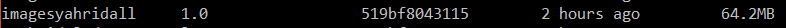

<h1>Cara Pengerjaan Docker UTS TCC</h1>

1. Langkah Pertama yang saya lakukan adalah menginstalasi Docker toolbox dikarenakan Docker Dekstop harus menggunakan Windows 10 pro sedangkan saya menggunakan windows 10 Home Edition. ketika sudah berhasil diinstall maka akan seperti gambar dibawah ini:

 

2. selanjutnya adalah pull atau cloning image sesuai keinginan yang telah tersedia pada dockerhub 

3. kalau sudah proses cloning selsai selanjutnya menjalankan isi dari image docker yang sebelumnya telah di cloning dengan perintah docker run

untuk menghentikan container yang sedang dirun/dijalankan saya menggunakan kill yaitu dengan memencet crtl+c lalu ketikkan kill kemudian enter

4. langkah selanjutnya ialah membuat image sendiri, saya membuat image dengan nama ag

lalu jalankan dengan perintah docker run

imagesyahridal saya buat pada Dockerfilenya dengan menggunakan base image dari ubuntu

5. selanjutnya ialah push image yang sudah dibuat sendiri ke dockerhub caranya adalah dengan menggunkan docker tag sebagai add repo/image yang ingin di push kemudian dengan docker push sebagai push ke docker hub

dan berikut adalah hasil push dari docker toolbox ke docker hub

link repo docker hub

https://hub.docker.com/repository/docker/syahridals/imagesyahridall
